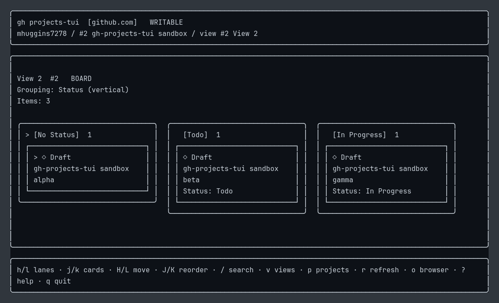
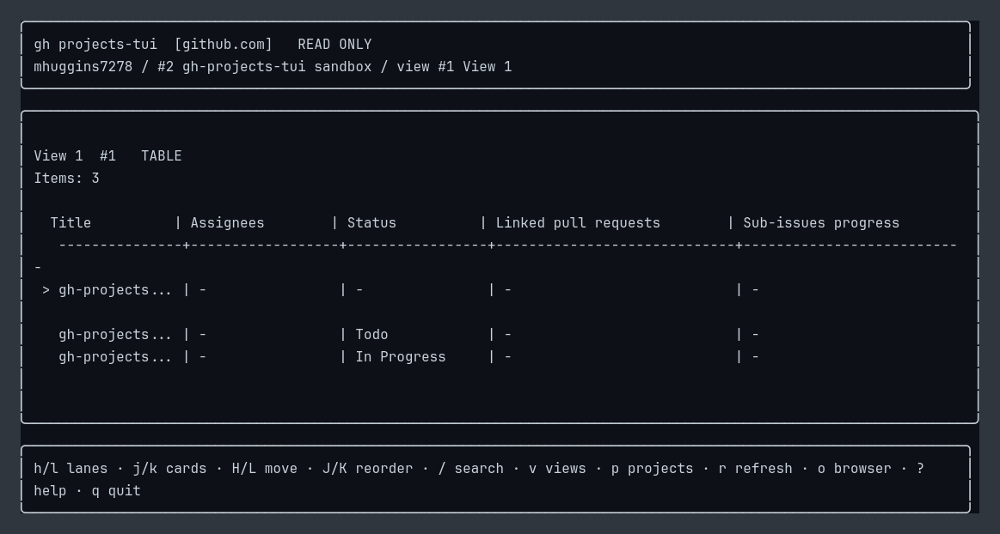

# gh-projects-tui

A terminal UI for GitHub Projects v2, built with Go and Bubble Tea.

**Status: pre-alpha, not published yet.** There are no published releases or
precompiled extension downloads. Run it manually from source using the steps
below. Features, keybindings, and supported view types are still evolving.

## Screenshots

These captures show the current pre-alpha interface running locally against a
disposable GitHub Projects sandbox. They are illustrative, not a published
binary or a promise of visual/API parity with GitHub's web UI.





## Run locally

### Prerequisites

- Go **1.25 or newer**.
- [GitHub CLI (`gh`)](https://cli.github.com/), authenticated with an account that
  can access the projects you want to use.
- Access to this repository and an interactive terminal.

Authenticate and check your login:

```sh
gh auth login
gh auth status
```

For a GitHub CLI OAuth login, grant project access and organization discovery
scopes if they are missing:

```sh
gh auth refresh -s project -s read:org -s repo
```

The `project` scope enables project writes; `repo` is needed for private repository
content. The app uses your existing GitHub CLI authentication. Organizations
blocked by SAML enforcement for your token are skipped during discovery.

### Clone and start

```sh
gh repo clone mhuggins7278/gh-projects-tui
cd gh-projects-tui
go run ./cmd/gh-projects-tui
```

Running without flags discovers your personal projects and accessible organization
projects, then opens the owner picker. The app does not persist or automatically
restore the previous owner, project, or view.

To open a specific project/view directly:

```sh
go run ./cmd/gh-projects-tui --owner OWNER --project NUMBER --view NUMBER
```

You can also pass only `--owner` to start at that owner's project picker.
`--project` requires `--owner`, and `--view` requires both `--owner` and
`--project`.

### Build a local binary

From the repository directory:

```sh
go build -o gh-projects-tui ./cmd/gh-projects-tui
./gh-projects-tui
# Or:
./gh-projects-tui --owner OWNER --project NUMBER --view NUMBER
```

The intended future extension command is `gh projects-tui`; the commands above
are the current way to run the unpublished app. After pulling updates, rerun
`go run` or rebuild your local binary.

## Current features

- Owner, project, and saved-view pickers with filtering.
- Progressive board loading, with parallel Status-lane loading where supported.
- Single-select and iteration grouping, including combined columns/swimlanes.
- Saved visible fields, supported field sorting, and local card search.
- Read-only table rendering using saved fields.
- Issue, pull request, and draft details, including Markdown bodies and project
  fields. Details are cached in memory until refresh or view changes.
- Optimistic card moves and reordering on supported writable boards.

### Card moves and saves

Moves appear immediately. Additional moves can be queued while GitHub saves them
one at a time, and card navigation stays responsive. Successful saves do not
reload the board. If a save fails, that move and subsequent queued moves are
rolled back; earlier successful saves are preserved. Partially completed saves
trigger item reconciliation.

View changes and manual refresh wait until the save queue finishes. Use `r` to
reload from GitHub when you want to pick up external changes.

## Keys

| Key | Action |
| --- | --- |
| `j/k` or `↑/↓` | Move through picker entries or cards |
| `h/l` or `←/→` | Navigate board lanes |
| `enter` | Select a picker entry or open item details |
| `H/L` (uppercase) | Move the selected card to an adjacent lane |
| `J/K` (uppercase) | Reorder the selected card within its lane |
| `/` | Filter picker entries or search loaded cards |
| `enter` / `esc` while searching | Finish search / clear search |
| `esc` or `backspace` | Go back |
| `v` | Pick a saved view |
| `p` | Pick a project |
| `r` | Refresh from GitHub; retry readback when a save outcome is unknown |
| `o` | Show the selected project's browser URL |
| `?` | Toggle help |
| `q` or `ctrl+c` | Quit |

In item details, `j/k` scrolls, `f` toggles all fields (including unset/unavailable
values), and `esc` closes the panel.

## Pre-alpha limitations

- Roadmap views are not supported.
- Supported saved filters are currently no filter, `iteration:@current`,
  `status:"value"`, `no:status`, `-status:"value"`, `assignee:@me`, and
  verified two-term conjunctions of Status with `assignee:@me`, negated Status
  with `assignee:@me`, or `iteration:@current` with Status. Other expressions and
  unsupported grouping/sorting semantics stay in the picker with an explanation.
- If a project has no compatible saved board, unsupported views stay in the
  picker with an explanation; the TUI never substitutes an unfiltered board.
- Card mutations require a writable, fully loaded, unfiltered board with
  single-select or iteration grouping. Combined boards require supported fields
  on both axes; `H/L` moves only between columns in the current swimlane.
  Clear local search before moving cards.
- Manual reordering requires project-position sorting and is disabled for
  combined-axis boards. Moving cards between swimlanes and saved-filtered views
  remain read-only.
- Writes are serialized and re-resolved against the latest project order.
  Rapid unsent moves of the same card collapse to the final placement.
  If a timeout leaves a save's outcome unknown, dependent writes pause until
  `r` confirms the state; `r` retries readback only and never resubmits the write.
  Switching views does not cancel a submitted write.
- Board loads use one paginated stream with only grouping, sort, and card
  fields; recent views/metadata are cached briefly and `r` forces a refresh.
  API cooldowns pace writes and pause with a visible countdown.
- Table support is an early preview; full parity with GitHub's table UI is not
  implemented.

Owner, project, and view selections are not saved between runs. Use the explicit
flags above when you want to open a specific board directly.

## Development

```sh
go test ./...
go test -race ./...
go vet ./...
go build ./...
```

The default tests use local fixtures. Opt-in live API tests and the verified
GitHub API behavior are documented in [docs/api-contract.md](docs/api-contract.md).
