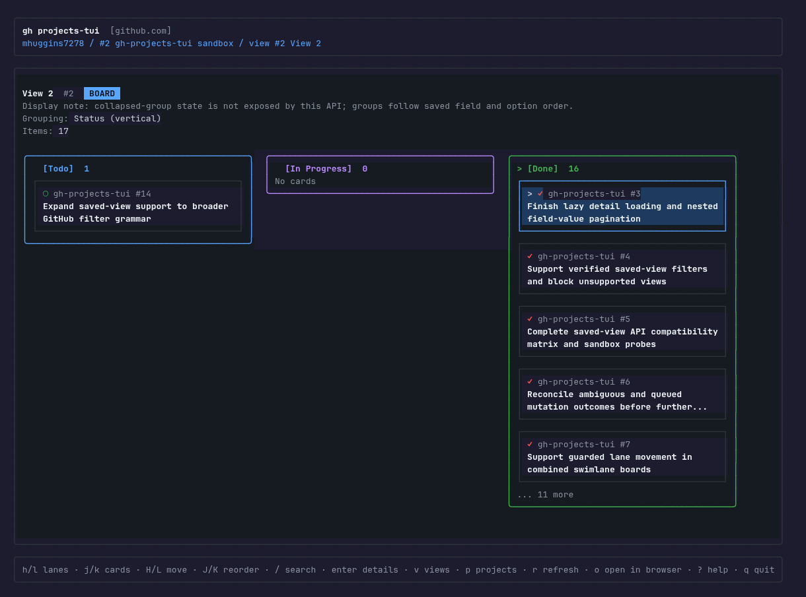
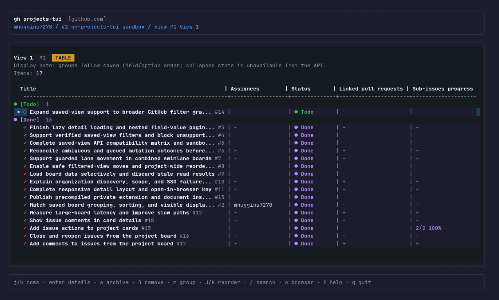
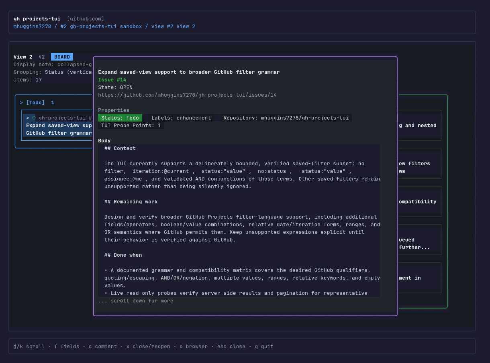

# gh-projects-tui

A terminal UI for GitHub Projects v2, built with Go and Bubble Tea.

**Status: pre-alpha.** Releases are private and installable by users with access
to this repository. Features, keybindings, and supported view types are still
evolving.

## Screenshots

Captured from the running TUI against a disposable GitHub Projects sandbox.
The board and table show the same saved project with live issues and fields;
the detail panel loads an issue on demand.

### Board: saved Status lanes and issue cards



### Table: grouped rows, saved columns, and sub-issue progress



### Issue details: project fields and Markdown body



## Install the GitHub CLI extension

The repository is private, so first authenticate with an account that can read
it and check the active host:

```sh
gh auth login
gh auth status
```

Install and run the extension:

```sh
gh extension install mhuggins7278/gh-projects-tui
gh projects-tui
```

Update it when a new release is available:

```sh
gh extension upgrade projects-tui
```

Remove it with `gh extension remove projects-tui`. Release tags trigger the
release workflow, which builds precompiled binaries and attaches them to the
private GitHub Release. The first-party `gh-extension-precompile` action
publishes assets that `gh extension install` can select for the local platform.

## Run locally

### Prerequisites

- Go **1.25 or newer**.
- [GitHub CLI (`gh`)](https://cli.github.com/), authenticated with an account that
  can access the projects you want to use.
- Access to this repository and an interactive terminal.

Authenticate and check your login:

```sh
gh auth login
gh auth status
```

For a GitHub CLI OAuth login, grant project access and organization discovery
scopes if they are missing:

```sh
gh auth refresh -s project -s read:org -s repo
```

The `project` scope enables project writes; `repo` is needed for private repository
content. The app uses your existing GitHub CLI authentication. Organizations
blocked by SAML enforcement for your token are skipped during discovery.

### Clone and start

```sh
gh repo clone mhuggins7278/gh-projects-tui
cd gh-projects-tui
go run ./cmd/gh-projects-tui
```

Running without flags discovers your personal projects and accessible organization
projects, then opens the owner picker. The app does not persist or automatically
restore the previous owner, project, or view.

To open a specific project/view directly:

```sh
go run ./cmd/gh-projects-tui --owner OWNER --project NUMBER --view NUMBER
```

You can also pass only `--owner` to start at that owner's project picker.
`--project` requires `--owner`, and `--view` requires both `--owner` and
`--project`. Pass `--debug` (or set `GH_PROJECTS_TUI_DEBUG=1`) to show API
telemetry in the header and enable the `A` inspector overlay, including measured
GraphQL points by operation.

Explicit local roadmap endpoint-field mappings can be supplied with
`--roadmap-mappings ./roadmaps.json`. They are scoped to host/project/view node
IDs and labeled as user-configured. Read-only timelines support DATE and ITERATION endpoints, the app's supported
saved filters, up to two supported ASC/DESC sorts, and one single-select group.
Use `j/k` for rows, `h/l` for months, and `g` for the current month. See [mapping setup and the current boundary](docs/local-roadmap-mappings.md).

### Build a local binary

From the repository directory:

```sh
go build -o gh-projects-tui ./cmd/gh-projects-tui
./gh-projects-tui
# Or:
./gh-projects-tui --owner OWNER --project NUMBER --view NUMBER
```

After pulling updates, rerun `go run` or rebuild your local binary.

## Current features

- Owner, project, and saved-view pickers with filtering.
- Progressive board loading through one paginated stream with selective fields.
- Single-select and iteration grouping, including combined columns/swimlanes.
- Saved visible fields, supported field sorting, and local card search.
- Table rendering using saved fields, single-field grouping, row navigation, local search, and issue sub-issue progress. Writable tables can archive or remove project items, change groups, and reorder position-sorted rows.
- Issue, pull request, and draft details, including Markdown bodies and project
  fields. Details are cached in memory until refresh or view changes.
- Optimistic card moves and reordering on supported writable boards.

### Card moves and saves

Moves appear immediately. Additional moves can be queued while GitHub saves them
one at a time, and card navigation stays responsive. A definitive final success
on the same unfiltered board keeps the session's saved state without a reload.
Failed or partially completed writes are reconciled before dependent moves
continue; unknown outcomes block further writes, and `r` checks the outcome
without resubmitting the write.

View changes and manual refresh can continue during saves. Submitted writes stay
attached to their original project and view. If a save overlaps an item refresh,
the refresh finishes and a fresh read follows it so stale pages cannot replace
the saved state. Use `r` to pick up external changes.

## Keys

| Key | Action |
| --- | --- |
| `j/k` or `↑/↓` | Move through picker entries or cards |
| `h/l` or `←/→` | Navigate board lanes |
| `enter` | Select a picker entry or open item details |
| `H/L` (uppercase) | Move the selected card to an adjacent lane |
| `J/K` (uppercase) | Reorder the selected card within its lane |
| `m` (table) | Pick a saved group for the selected row; `j/k` choose and `enter` moves |
| `J/K` (table) | Reorder the selected row within its group when project-position sorted |
| `a` / `D` (table) | Archive / remove the selected item from this project (confirmation required) |
| `/` | Filter picker entries or search loaded cards |
| `enter` / `esc` while searching | Finish search / clear search |
| `esc` or `backspace` | Go back |
| `v` | Pick a saved view |
| `p` | Pick a project |
| `r` | Refresh saved-view settings and items from GitHub; retry readback when a save outcome is unknown |
| `o` | Open the selected item or project in a browser |
| `?` | Toggle help |
| `q` or `ctrl+c` | Quit |

In item details, `j/k` scrolls, `f` toggles all fields (including unset/unavailable
values), and `esc` closes the panel. For GitHub issues on boards, `c` opens a comment
composer (`enter` submits, `esc` cancels), and `x` prompts to close or reopen the
issue (`enter` confirms, `esc` cancels). Pull requests and draft issues do not
offer these issue actions.

## Pre-alpha limitations

- Roadmaps require explicit local DATE/ITERATION endpoint mappings. One
  single-select group uses local API option order, unset last, and all groups
  expanded. Supported filters and up to two supported ASC/DESC sorts reuse the
  board/table rules. Vertical/multiple/iteration grouping and restored web
  display settings remain unsupported.
  See [the timeline boundary and remaining gates](docs/roadmap-proposal.md).
- Saved filters support `status:Todo`, `status:"In Progress"`, `assignee:@me`,
  `assignee:USERNAME`, `label:bug`, `repo:OWNER/REPO`, `is:open`, `is:closed`,
  `is:issue`, `is:pr`, `is:draft`, `is:merged`, `type:Epic` or
  `type:"Epic"` for issue types, `parent-issue:OWNER/REPO#123` (optionally
  double-quoted), `reviewers:USERNAME`, `reason:completed`, and
  `reason:"not planned"`. `has:`/`no:` check Status, assignee, label, reviewers,
  parent-issue, closed, and verified single-select/number/iteration project fields.
  `iteration:@current` is also supported. Custom fields use their hyphenated names, for
  example `phase:"Phase I"`, `points:>=2`, or `sprint:@previous`. `created:`,
  `updated:`, and `closed:` accept dates, comparisons, ranges, and relative
  `@today` offsets. `closed:` filters the closure date, not the current state;
  use `is:closed` for the latter.
  `title:"Exact title"`, `title:*word*`, `label:*word*`, and unqualified words
  such as `filter` use GitHub's text matching. Commas inside exact quoted titles
  are supported, but embedded escaped quotes remain blocked.
  Values separated by commas in a single-select, assignee, reviewers, label,
  numeric, or supported reason qualifier act as OR; whitespace-separated terms
  act as AND (including repeated qualifiers). A leading `-` negates supported
  qualifiers except iteration and `has:`; `-no:` checks for a present value.
  Double-quote Status or label names with spaces, for example `status:"In Progress"`.
  Examples: `label:bug,support assignee:@me` and `status:"Todo","Done" is:issue`.
  See [the filter grammar and evidence matrix](docs/api-contract.md#saved-filter-grammar-and-evidence)
  for exact boundaries. Cross-field `OR`, unquoted grouping parentheses, unverified custom field types,
  next-iteration offsets, reviewer `@me`/team references, `reason:reopened`,
  milestone filters, unverified text-field/wildcard forms, escaped/single quotes,
  and other unverified forms remain blocked with a
  picker explanation. Unsupported grouping/sorting semantics are also blocked.
- If a project has no compatible saved board, unsupported views stay in the
  picker with an explanation; the TUI never substitutes an unfiltered board.
- Card mutations require a writable, fully loaded board with
  single-select or iteration grouping. Combined boards require supported fields
  on both axes; `H/L` moves only between columns in the current swimlane.
  Clear local search before moving cards.
- Manual reordering requires project-position sorting and is disabled for
  combined-axis boards. Moving cards between swimlanes remains read-only.
  Supported saved-filtered boards use unfiltered project state to resolve writes;
  moves can affect hidden items and other views because position is project-wide.
- Writes are serialized and re-resolved against the latest project order.
  Rapid unsent moves of the same card collapse to the final placement.
  If a timeout leaves a save's outcome unknown, dependent writes pause until
  `r` confirms the state; `r` retries readback only and never resubmits the write.
  Switching views does not cancel a submitted write.
- Board loads use one paginated stream with only grouping, sort, and card
  fields; recent views/metadata are cached briefly and `r` forces a refresh.
  API cooldowns pace writes; `--debug` shows their countdown and request telemetry.
- Table support is an early preview; full parity with GitHub's table UI is not
  implemented. Table actions require update access, a complete item load, and
  no local search. Group moves require one writable single-select or iteration
  grouping field; reordering requires project-position sorting. Removing a
  project-only draft deletes that draft, while removing an issue or PR leaves
  its repository content intact. Archiving retains an item for restoration on
  GitHub. Unknown outcomes keep a write gate across navigation; `r` checks
  the originating project's unfiltered active items before unlocking further writes.

Owner, project, and view selections are not saved between runs. Use the explicit
flags above when you want to open a specific board directly.

## Development

```sh
go test ./...
go test -race ./...
go vet ./...
go build ./...
```

The default tests use local fixtures. Opt-in live API tests and the verified
GitHub API behavior are documented in [docs/api-contract.md](docs/api-contract.md).

The live smoke test is read-only and opt-in. Supply an owner and project/view
that your authenticated `gh` account can read; set owner kind to `user` for a
personal project (organization is the default):

```sh
GH_PROJECTS_TUI_LIVE_OWNER=OWNER \
GH_PROJECTS_TUI_LIVE_PROJECT=PROJECT_NUMBER \
GH_PROJECTS_TUI_LIVE_VIEW=VIEW_NUMBER \
go test -tags live ./internal/github
```

It runs discovery, opens the selected view, pages items, and loads one item's
detail. It does not submit mutations. Mutation verification belongs only on the
disposable sandbox project documented in `docs/api-contract.md`.

The saved-filter contract test is also read-only. It requires an existing project
with populated closure dates and parent-linked child issues, checks membership
against a complete unfiltered metadata baseline, and forces two-item pages to
exercise cursor pagination. It also checks created/updated date forms and Status
OR, repeated-qualifier AND, negation, and cross-field AND when two populated
Status values exist. Missing optional samples are reported. The
[latest filter audit](docs/filter-audit-2026-09-30.md) records the results and the
distinction between project-item and issue update timestamps:

```sh
GH_PROJECTS_TUI_LIVE_FILTERS=1 \
GH_PROJECTS_TUI_LIVE_OWNER=OWNER \
GH_PROJECTS_TUI_LIVE_OWNER_KIND=user \
GH_PROJECTS_TUI_LIVE_PROJECT=PROJECT_NUMBER \
go test -tags live ./internal/github -run '^TestLiveSavedFilterContract$' -count=1
```

The read-only [roadmap investigation probe](docs/api-contract.md#reproducible-read-only-probe)
can inspect an existing saved roadmap's schema and aggregate date/iteration data.
It does not enable roadmap rendering or change project data.
